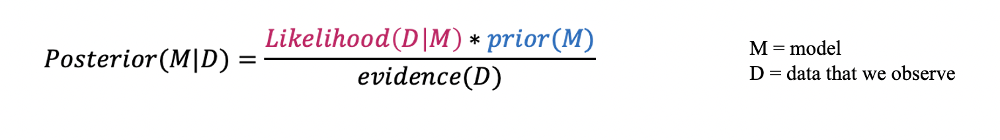
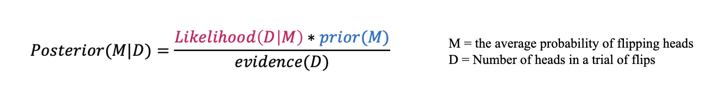
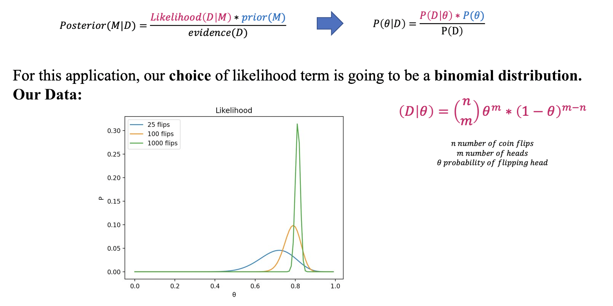
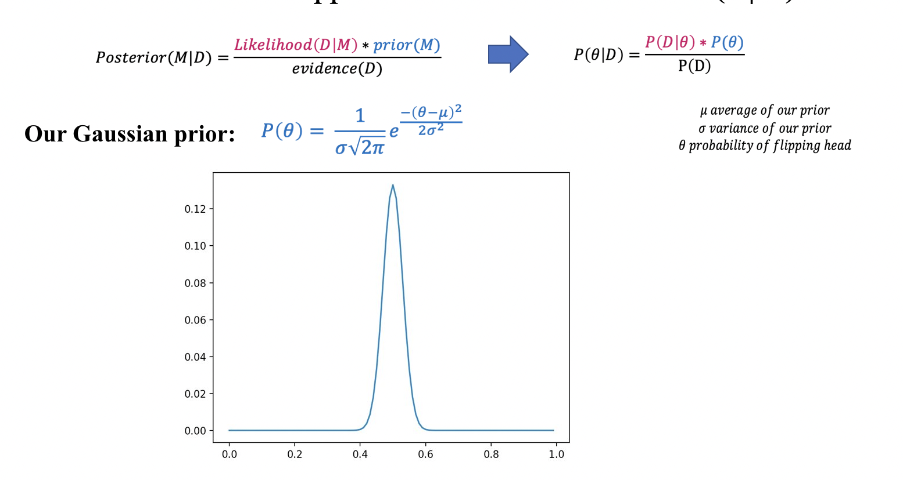
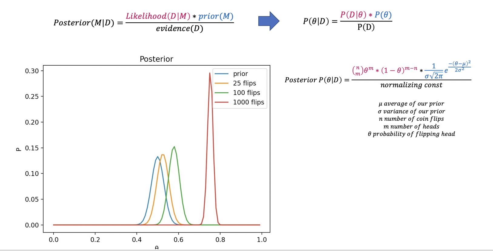
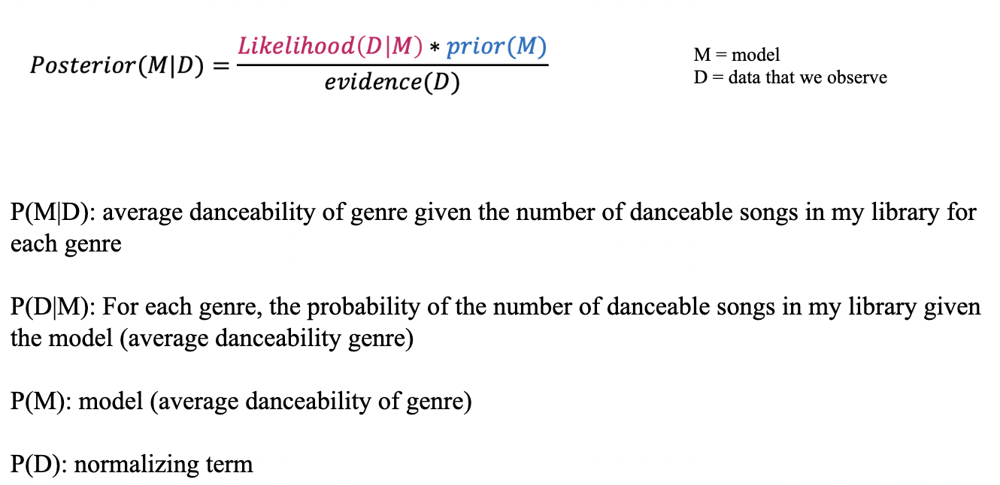
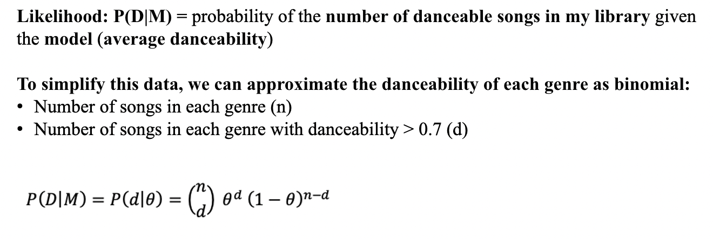
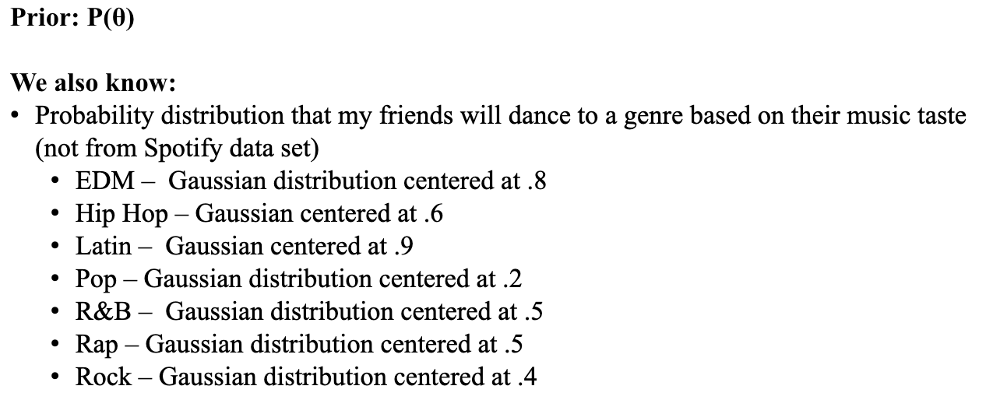
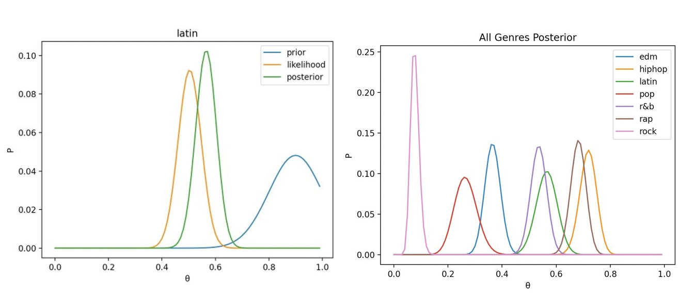

# Bayesian model inference applied
This project contains an exploration of Bayesian model inference applied to a Spotify data set. The aim of this project is to determine the probability of a model given some data, which each have their own probability distributions.

Note: this repo is my contribution to a larger overall project done in collaboration with Noah Beliveau, Jake Hayward, and Bridget Mohler. 
# Background on Bayesian model inference


For those who are new to Bayes rule, we can consider a very simple example of model inference. Lets say that we want to find out if a particular coin is biased. Our data will be the number of heads in a trial of flips, and our model will simply be the average probability of flipping head. 


So, we gather our data, and we normalize our trials so we can compare them to one another. 

On the X axis (theta), the peak of the distribution represents the most likely value of theta (model). The Y axis is the probability of getting a particular trial. So in total, the whole visualization represents the probability of a particular trial happening given each value of theta, which is our likelihood term!
What a binomial distribution helps us do is take into account the fact that when we have limited data, our result is less meaningful. So, looking at the blue line, we can see that after only 25 flips, we not very confident in any probability value. However, given more data, we become more confident! Clearly, this is a very strange coin that we have because our data is telling us that the probability of getting a head is centered around .8.

Just like for the likelihood term, in model inference, you can consider a multitude of different kinds of priors. 

For our case, lets say you have literally never seen a biased coin in your life, so you have a pretty extreme prior. You aren't necessarily ruling out the possibility of biased coin completely, but it would take a lot to change your mind. We can represent this as a Gaussian distribution centered at .5. 

To apply Bayes' rule we put together the prior and likelihood and we get our posteriors (the orange, green, and red lines).

Our posterior tells us the most probable value of theta given our data, which is the most probable value of our model! We can see how with only 25 flips, even though our coin was heavily biased at .8, our distribution shifts only slightly to the right. As more flips happen, we continue to update our belief about the coin and become more convinced that it is in fact biased.

NOTE: I used numpy, matplotlib, and scipy to support my calculations and create the visualizations you see above. Please reference the files below for details. 
```
coin_binomial_dist.py
coin_bayes.py
```
To apply the calculations and re-create the visualizations, simply run these commands:

```
python coin_bayes.py
python coin_binomial_dist.py
```
# Bayesian model inference applied to Spotify data
We can also apply these same techniques to user-generated Spotify data-sets. To help think about why someone might want to do this, I created a "real-life scenario" to help: 
Let’s say you are having a themed dance party, and you want pick a specific music genre. You have some prior information about how likely your friends are to dance to a particular genre (based on your perception of their music tastes). You also have access to your Spotify data, which gives each of your songs a danceability rank based on “how suitable a track is for dancing based on a combination of musical elements. A value of 0.0 is least danceable and 1.0 is most danceable” (this is determined by Spotify). You want to update your prior belief about your friends probability to dance based on the new info that Spotify can provide.


For the likelihood term, we will approximate the probability of our Spotify data as a binomial distribution, just like the coin flip example. 

Here, we are looking at the number of danceable songs (rather than number of heads) with average at θ.

Now for the prior, lets say that I have gone to a bunch of concerts with my friends, and I have some knowledge that my friends really like to dance to EDM, Hip Hop, and Latin music, but don't really like to dance to Rock or Pop. I don’t really have any information about R&B or Rap.


Again, just like in the coin flip example, we calculate the posterior with the same equations. 

Looking at the Latin genre: We had a significant prior my friends would dance to Latin music, but after considering the danceability of my Latin songs, the most likely value of theta is lower than our prior (this is Bayesian model inference in action!). 
On the right, we can see the posterior of each genre, showing us that we should pick hip hop as our theme, and we should definitely not pick rock (especially because it is very narrow, indicating our certainty). 

NOTE: I used numpy, matplotlib, and scipy to support my calculations and create the visualizations you see above. Please reference the files below for details. 
```
Spotify_dancability.py
finalproject5002v2.py
```
The data set for this project is:
```
spotify_genre_final1.xlsx
```
Please be aware that this is just an example of a general user's spotify data. The resulting visualizations will rightly change depending on the specifics of a user's library, the priors, etc. 

To apply the calculations and re-create the visualizations, simply run these commands:

```
python Spotify_dancability.py
python finalproject5002v2.py
```
The command line will prompt you to enter a genre (rock, edm, pop, hiphop, latin, r&b, rap). Type in the genre you want to analyze and press enter to see the visualizations.

# References used
https://towardsdatascience.com/bayes-rule-applied-75965e4482ff
https://www.youtube.com/watch?v=OByl4RJxnKA
https://www.bu.edu/sph/files/2014/05/bayesian-networks-final.pdf https://www.cs.utexas.edu/~bornholt/papers/bayes-approx14.pdf https://towardsdatascience.com/introduction-to-bayesian-belief-networks-c012e3f59f1b https://seeing-theory.brown.edu/bayesian-inference/index.html
https://en.wikipedia.org/wiki/Thomas_Bayes
https://en.wikipedia.org/wiki/Binomial_distribution https://stackoverflow.com/questions/19125722/adding-a-legend-to-pyplot-in-matplotlib-in-the-simplest-manner-possible https://www.statisticshowto.com/probability-and-statistics/binomial-theorem/binomial-distribution-formula/ https://en.wikipedia.org/wiki/Normal_distribution
https://en.wikipedia.org/wiki/Gaussian_function https://docs.scipy.org/doc/scipy/reference/special.html
https://matplotlib.org/ https://www.kaggle.com/naoh1092/spotify-genre-audio-features?select=spotify_genre_final.xlsx
Zhu, Xing-Jiang, and Eric Thrane. “Toward the Unambiguous Identification of Supermassive Binary Black Holes through Bayesian Inference.” The Astrophysical Journal, vol. 900, no. 2, The American Astronomical Society, 2020, p. 117, doi:10.3847/1538-4357/abac5a.
“A Bayesian Network Model for Diagnosis of Liver Disorders” – Agnieszka Onisko, M.S., Marek J. Druzdzel, Ph.D., and Hanna Wasyluk, M.D.,Ph.D.- September 1999.
